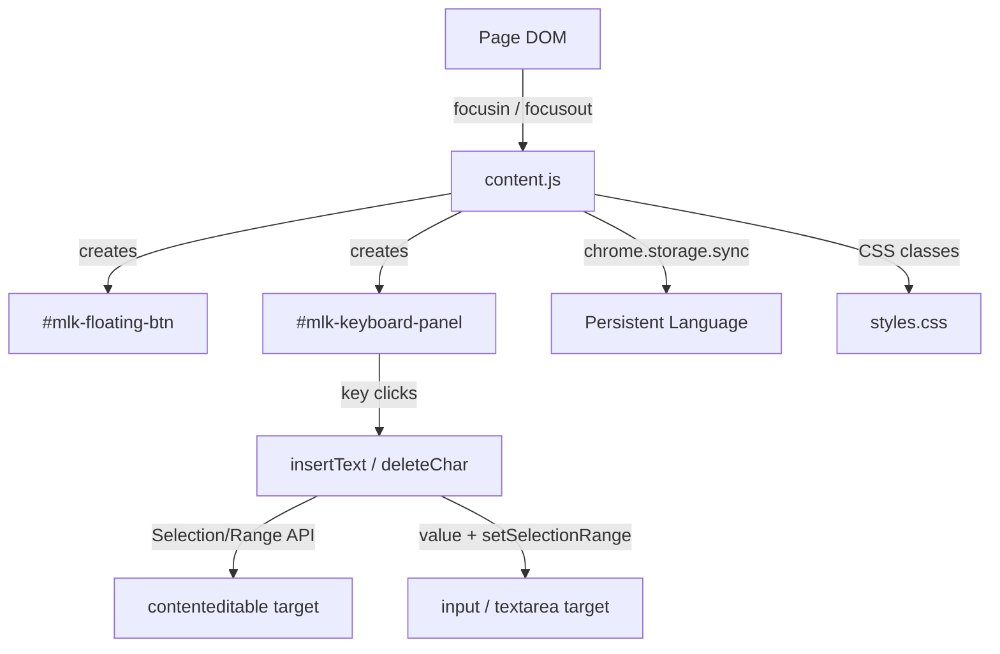

# Design: MultiLang Keyboard Refinements

## Overview

This document describes the technical design for a set of targeted refinements to the MultiLang Keyboard Chrome MV3 extension. The extension injects a floating virtual keyboard into any webpage, enabling users to type in English, Hindi, Marathi, Telugu, Tamil, and Bengali into any `<input>`, `<textarea>`, or `contenteditable` element.

The refinements address six areas:

1. **Bug fixes** — correct contenteditable text insertion/deletion using the Selection/Range API; prevent the floating button from hiding when the user clicks the keyboard panel; clear stale `currentInput` references.
2. **CSS extraction** — move all inline styles from `content.js` into `styles.css` and register the stylesheet in `manifest.json`.
3. **Performance** — replace full `innerHTML` rebuilds in `renderKeyboard()` with partial DOM updates when only the Shift state changes.
4. **UX** — add drag support for the keyboard panel, open/close CSS animations, and a visual highlight on the active target input element.
5. **Error handling** — wrap `navigator.clipboard.writeText` in a `try/catch` with a `document.execCommand('copy')` fallback.
6. **Persistent language preference** — save and restore the last-used language via `chrome.storage.sync`; add the `storage` permission to `manifest.json`.

All changes are confined to `content.js`, `styles.css`, and `manifest.json`. No new files are introduced beyond the spec directory.

---

## Architecture

The extension follows a single content-script architecture. One JavaScript file (`content.js`) is injected into every page at `document_idle`. It creates two DOM elements — a floating toggle button (`#mlk-floating-btn`) and a keyboard panel (`#mlk-keyboard-panel`) — and manages all interaction logic.



The refinements do not change this topology. They improve correctness, style separation, and user experience within the same single-script model.

---

## Components and Interfaces

### 1. Target Input Management

**Current state:** `currentInput` is set on `focusin` and never cleared. Stale references persist after an element is removed from the DOM.

**Refined behaviour:**
- On `focusout`, if the newly focused element is not a valid input target and the keyboard panel is not open, set `currentInput = null`.
- Before every use of `currentInput` inside key-click handlers, guard with `if (!currentInput || !document.contains(currentInput)) return;`.
- Add a visual CSS class (`mlk-active-target`) to the focused element and remove it when focus leaves.

```
Interface: TargetInputManager
  currentInput: Element | null
  setTarget(el: Element): void      // adds mlk-active-target class, stores ref
  clearTarget(): void               // removes class, nulls ref
  isValid(): boolean                // document.contains check
```

### 2. contenteditable Insertion / Deletion

**Current state:** `insertText` appends to `textContent`, losing cursor position. Backspace (`←`) slices `textContent` from the end, ignoring cursor.

**Refined behaviour:** Use `window.getSelection()` and `Range` to insert at the caret and delete the character immediately before it.

```
Interface: ContentEditableEditor
  insertAtCaret(el: Element, text: string): void
    // get selection, collapse to caret, insert text node, advance range
  deleteBeforeCaret(el: Element): void
    // get selection, extend range one character backwards, delete
```

For `<input>` and `<textarea>` the existing `selectionStart`/`selectionEnd` + `setSelectionRange` approach is correct and unchanged.

### 3. Floating Button Visibility

**Current state:** `focusout` fires when the user clicks a key on the panel (because focus leaves the input). The 200 ms `setTimeout` check sees `document.activeElement` as the panel button and hides the floating button.

**Refined behaviour:** In the `focusout` handler, also check whether the newly focused element is inside `#mlk-keyboard-panel`. If so, do not hide the button and do not clear `currentInput`.

```javascript
document.addEventListener('focusout', (e) => {
  setTimeout(() => {
    const active = document.activeElement;
    if (panel.contains(active)) return; // clicking inside panel — keep button visible
    if (!active.matches('input, textarea, [contenteditable="true"]')) {
      targetManager.clearTarget();
      floatingBtn.classList.remove('mlk-btn-visible');
    }
  }, 200);
});
```

### 4. CSS Extraction

All visual properties currently expressed as `element.style.cssText = ...` strings in `content.js` are moved to named CSS classes in `styles.css`. `content.js` only adds/removes class names.

Key classes:

| Class | Replaces |
|---|---|
| `#mlk-floating-btn` | inline styles on the button element |
| `#mlk-keyboard-panel` | inline styles on the panel element |
| `.mlk-btn-visible` | `opacity:1; pointer-events:all` |
| `.mlk-btn-pressed` | `transform: scale(0.9)` |
| `.mlk-panel-open` | `display: block` (+ animation) |
| `.mlk-lang-btn` | language selector button base styles |
| `.mlk-lang-btn--active` | active language highlight |
| `.mlk-key` | standard key styles |
| `.mlk-key--space` | space bar overrides |
| `.mlk-key--action` | Enter / ← styles |
| `.mlk-key--shift` | Shift key base |
| `.mlk-key--shift-active` | Shift engaged highlight |
| `.mlk-action-btn` | Copy / Clear / Close button styles |
| `.mlk-toast` | toast notification |
| `.mlk-active-target` | outline on the focused input element |

`manifest.json` gains a `css` entry in `content_scripts`:

```json
"css": ["styles.css"]
```

### 5. Partial DOM Updates in renderKeyboard()

**Current state:** Every Shift toggle calls `renderKeyboard()` which sets `panel.innerHTML = ...`, destroying and recreating all ~60 key buttons and re-attaching all event listeners.

**Refined behaviour:** Split rendering into two functions:

- `buildKeyboard()` — called once when the panel is first opened (or when the language changes). Constructs the full DOM tree and attaches all event listeners.
- `updateShiftState()` — called only when Shift is toggled. Iterates existing key buttons and updates their `textContent` and CSS classes in place. No DOM nodes are created or destroyed.

```
Interface: KeyboardRenderer
  buildKeyboard(lang: string, isShift: boolean): void
  updateShiftState(isShift: boolean): void
  updateLanguage(lang: string): void   // rebuilds keys for new language
```

Language changes still trigger a full rebuild because the key set changes entirely.

### 6. Drag Support

The keyboard panel gains drag-to-reposition behaviour using `mousedown`/`mousemove`/`mouseup` on a dedicated drag handle element at the top of the panel.

```
Interface: DragController
  attach(panel: Element, handle: Element): void
  // stores offset on mousedown, updates panel.style.left/top on mousemove
  // clamps to viewport bounds
  // removes listeners on mouseup
```

Position is stored in module-level variables `panelX`, `panelY` and applied as `left`/`top` (overriding the default `right`/`bottom` positioning once dragged).

### 7. Open/Close Animation

The panel uses a CSS `@keyframes` animation for open (`mlk-slide-in`) and close (`mlk-slide-out`). The close animation is triggered by adding a class; the `animationend` event removes `mlk-panel-open` after the animation completes.

### 8. Clipboard Error Handling

```javascript
async function copyToClipboard(text) {
  try {
    await navigator.clipboard.writeText(text);
  } catch {
    // Fallback: create a temporary textarea and use execCommand
    const ta = document.createElement('textarea');
    ta.value = text;
    ta.style.position = 'fixed';
    ta.style.opacity = '0';
    document.body.appendChild(ta);
    ta.select();
    document.execCommand('copy');
    ta.remove();
  }
  showToast('Copied!');
}
```

### 9. Persistent Language Preference

On language selection, save to `chrome.storage.sync`:

```javascript
chrome.storage.sync.set({ mlkLang: lang });
```

On initialisation, restore:

```javascript
chrome.storage.sync.get('mlkLang', ({ mlkLang }) => {
  if (mlkLang && LAYOUTS[mlkLang]) currentLang = mlkLang;
});
```

`manifest.json` gains `"storage"` in the `permissions` array.

---

## Data Models

### Module State

```typescript
// All state lives in the IIFE closure
let currentInput: Element | null;   // currently focused input/textarea/contenteditable
let currentLang: string;            // key into LAYOUTS, default 'english'
let isShift: boolean;               // shift toggle state
let panelX: number | null;          // drag-repositioned X (null = use CSS default)
let panelY: number | null;          // drag-repositioned Y (null = use CSS default)
let keyboardBuilt: boolean;         // true after buildKeyboard() has run for currentLang
```

### LAYOUTS

Unchanged from the current implementation. Each entry:

```typescript
interface LanguageLayout {
  name: string;           // display name (may contain Unicode)
  normal: string[][];     // rows of keys in normal state
  shift: string[][];      // rows of keys in shift state
}

const LAYOUTS: Record<string, LanguageLayout>;
```

### chrome.storage.sync Schema

```json
{ "mlkLang": "hindi" }
```

Single key, string value, one of the six language identifiers.

---

## Correctness Properties


*A property is a characteristic or behavior that should hold true across all valid executions of a system — essentially, a formal statement about what the system should do. Properties serve as the bridge between human-readable specifications and machine-verifiable correctness guarantees.*

### Property 1: contenteditable caret-aware insertion

*For any* contenteditable element containing any string and with the caret at any valid offset, calling `insertAtCaret` with any text string should result in the element's text content having the inserted text at exactly that offset, with all preceding and following characters unchanged.

**Validates: Requirements 1.1**

### Property 2: contenteditable caret-aware deletion

*For any* contenteditable element containing a non-empty string and with the caret at any position greater than zero, calling `deleteBeforeCaret` should remove exactly the character at `caretOffset - 1` and leave all other characters unchanged.

**Validates: Requirements 1.2**

### Property 3: CSS classes cover all keyboard elements

*For any* language in LAYOUTS, after `buildKeyboard()` runs, every keyboard element (panel, language buttons, key buttons, action buttons) should have at least one `mlk-*` CSS class and no non-empty inline `style` attribute (excluding the panel's `left`/`top` during an active drag).

**Validates: Requirements 2.1, 2.2**

### Property 4: Shift toggle reuses existing DOM nodes

*For any* keyboard state, toggling Shift should update the `textContent` and CSS classes of existing key button elements in place — the set of `button[data-key]` DOM node references inside the panel should be identical before and after the toggle.

**Validates: Requirements 3.1**

### Property 5: Language change rebuilds key layout

*For any* two distinct languages A and B, switching from A to B via `updateLanguage()` should result in all `button[data-key]` elements reflecting language B's normal-state key characters.

**Validates: Requirements 3.2**

### Property 6: Drag repositions panel within viewport bounds

*For any* sequence of `mousemove` events during a drag, the panel's computed `left` and `top` values should always satisfy `0 <= left <= viewport.width - panel.width` and `0 <= top <= viewport.height - panel.height`.

**Validates: Requirements 4.1**

### Property 7: Active-target class round-trip

*For any* input, textarea, or contenteditable element, simulating `focusin` should add the `mlk-active-target` class to that element, and subsequently simulating `focusout` to a non-panel element should remove the class, restoring the element's original class list.

**Validates: Requirements 4.3, 4.4**

### Property 8: Language persistence round-trip

*For any* language identifier in LAYOUTS, selecting that language (which calls `chrome.storage.sync.set`) and then re-running the initialisation restore path (which calls `chrome.storage.sync.get`) should result in `currentLang` equalling the originally selected language.

**Validates: Requirements 6.1, 6.2**

---

## Error Handling

### Stale currentInput references

Before every read or write of `currentInput` inside event handlers, guard with:

```javascript
if (!currentInput || !document.contains(currentInput)) {
  targetManager.clearTarget();
  return;
}
```

This prevents exceptions when the target element has been removed from the DOM between focus and key-press events (e.g., single-page app navigation).

### Clipboard API failure

`navigator.clipboard.writeText` requires a secure context and user gesture. On some pages it may be blocked by permissions policy. The fallback uses a hidden `<textarea>` and `document.execCommand('copy')`, which works in all contexts where the extension has focus.

```javascript
async function copyToClipboard(text) {
  try {
    await navigator.clipboard.writeText(text);
  } catch {
    const ta = document.createElement('textarea');
    ta.value = text;
    ta.style.cssText = 'position:fixed;opacity:0;pointer-events:none';
    document.body.appendChild(ta);
    ta.select();
    document.execCommand('copy');
    ta.remove();
  }
  showToast('Copied!');
}
```

### chrome.storage.sync unavailability

If `chrome.storage` is undefined (e.g., in a non-extension context during testing), the storage calls are wrapped in a guard:

```javascript
if (typeof chrome !== 'undefined' && chrome.storage?.sync) {
  chrome.storage.sync.get('mlkLang', restore);
}
```

### Unknown language in storage

If the stored value is not a key in `LAYOUTS`, the restore silently falls back to `'english'`:

```javascript
if (mlkLang && LAYOUTS[mlkLang]) currentLang = mlkLang;
```

### Selection API unavailability

`window.getSelection()` returns `null` in some edge cases (e.g., hidden iframes). Guard before use:

```javascript
const sel = window.getSelection();
if (!sel || sel.rangeCount === 0) return;
```

---

## Testing Strategy

### Dual Testing Approach

Both unit tests and property-based tests are required. Unit tests cover specific examples and error paths; property tests verify universal correctness across randomised inputs.

### Unit Tests (specific examples and error paths)

- Clicking inside the keyboard panel does not hide the floating button (Requirement 1.3)
- A detached `currentInput` element causes key insertion to be skipped without throwing (Requirement 1.4)
- `copyToClipboard` shows a toast on success (Requirement 5.1)
- `copyToClipboard` falls back to `execCommand` when `navigator.clipboard.writeText` rejects, and still shows a toast (Requirement 5.2)
- Opening the panel adds the `mlk-panel-open` class (Requirement 4.2)
- An unrecognised language in `chrome.storage.sync` causes `currentLang` to remain `'english'` (edge case from Requirement 6.2)

### Property-Based Tests

Use a property-based testing library appropriate for the target language (e.g., **fast-check** for JavaScript/TypeScript). Each property test must run a minimum of **100 iterations**.

Each test must be tagged with a comment in the format:
`// Feature: multilang-keyboard-refinements, Property {N}: {property_text}`

| Property | Test description |
|---|---|
| Property 1 | Generate random strings and caret offsets; verify insertion correctness |
| Property 2 | Generate random non-empty strings and caret offsets > 0; verify deletion correctness |
| Property 3 | For each language, build keyboard and assert class/style invariants on all elements |
| Property 4 | Build keyboard, capture node refs, toggle Shift, assert same node refs remain |
| Property 5 | For each pair of distinct languages, switch and assert key labels match layout |
| Property 6 | Generate random drag coordinates; assert panel stays within viewport bounds |
| Property 7 | For random input elements, simulate focusin/focusout and assert class round-trip |
| Property 8 | For each language, set storage and restore; assert currentLang matches |
